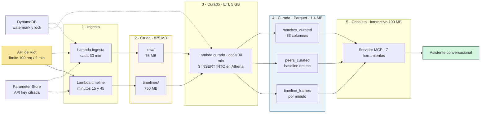
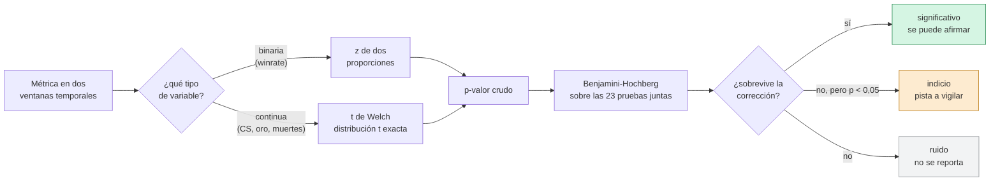
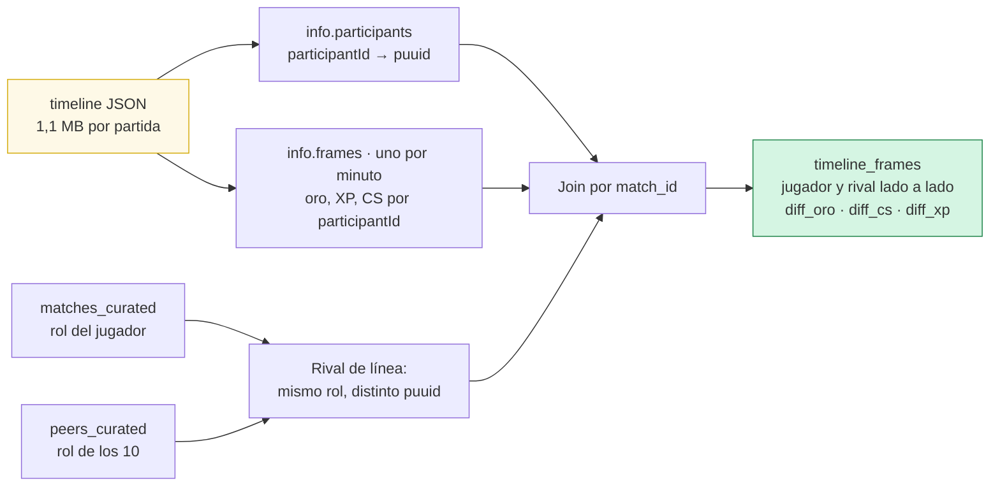
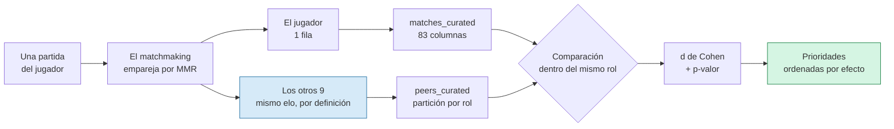

# Pipeline de datos de League of Legends en AWS

> **English summary.** The rest of this document is in Spanish; this section
> covers the design and the findings.

A serverless pipeline that ingests League of Legends matches from the Riot
API into an S3 data lake, and exposes the analysis to a conversational
assistant through a remote **MCP server** you connect by pasting a URL.

**What makes it more than a dashboard** is that it refuses to report noise.
Every comparison carries a p-value and a three-level verdict — *significant*
/ *hint* / *noise* — using Welch's t-test and a two-proportion z-test,
corrected with Benjamini-Hochberg across ~23 simultaneous metrics. Priorities
are ranked by **Cohen's d, not p-value**: against thousands of peer games
almost everything comes out significant, so effect size is what identifies
what matters. The statistics are implemented from scratch in ~240 lines with
no scipy — validated against closed forms and standard t-tables.

**A peer baseline without a global database.** The other nine players in
every match are matchmade at the same MMR, so they are a free same-elo
reference — 6,468 rows from ~5,200 distinct players, derived from the user's
own matches. It removes the fixed cost that a global stats database implies.

**Architecture.** Three Lambdas (match ingestion, timeline download, curation)
on EventBridge schedules, writing JSON to S3 and projecting it to Parquet with
Athena `INSERT INTO`. 825 MB of raw JSON becomes 1.4 MB of Parquet: the same
champion-winrate query scans 75 MB against raw and 2.5 KB against the curated
layer. Two Athena workgroups keep a 100 MB guardrail on the interactive path
while ETL gets 5 GB. Everything runs at roughly **$0.05/month**.

**What it found**, on 800 matches from one Master-tier account:

- Comparing wins against losses, what collapses is objectives — towers
  (Cohen's d = 1.62), dragons (1.26), objective damage (1.25) — while kill
  participation is **0.495 in wins vs 0.522 in losses**, ruling out the
  advice that generic coaching converges on.
- A 2.8-point winrate drop over 30 days came back at **p = 0.71**: noise a
  dashboard would have reported as a slump.
- Patch nerfs to a main champion were confirmed against Data Dragon, but
  testing all 18 patches with ≥10 games and correcting for multiple
  comparisons showed **none** was significantly different.

**Guardrails against the assistant overclaiming.** Every metric ships a
`como_reportar` field stating what may be said about it, because the same
warning in a docstring did not stop the model from asserting a *hint* as
fact — guidance has to travel next to the number. The MCP `instructions`
declare what the server cannot do, after the model invented an API
limitation to explain a missing tool.

**Layout:** `terraform/` (infrastructure, remote state in S3), `lambda*/`
(ingestion, timelines, curation), `mcp-server/` (11 MCP tools + statistics),
`tests/` (47 tests), `queries.sql` (15 documented Athena queries),
[`ANALISIS.md`](ANALISIS.md) (findings with their limitations).

### El conector en uso


*Se conecta pegando una URL en Claude.ai, sin instalar nada. El
razonamiento es por eliminación: lo que **no** difiere entre victorias y
derrotas descarta esas fases como causa, y es la mitad informativa de la
respuesta. Las cinco diferencias reales van ordenadas por tamaño de
efecto, no por p-valor.*

---

Pipeline serverless que ingiere partidas desde la API de Riot Games hacia
un data lake en S3, consultable con SQL vía Athena. Toda la infraestructura
está definida en Terraform.

El objetivo no era solo mover datos: cada componente se eligió resolviendo
una tensión concreta entre costo, límites externos y complejidad operacional.
Este documento explica esas decisiones.

---

## Arquitectura



**Flujo.** EventBridge dispara la ingesta cada 30 minutos: lee la API key
desde Parameter Store, consulta en DynamoDB qué partidas ya se ingirieron,
pide a Riot solo las nuevas y las escribe en S3 particionadas por jugador y
fecha. La descarga de timelines corre desfasada 15 minutos porque comparte
el límite de la misma key. El curado proyecta ambas capas crudas a Parquet
con consultas de Athena, y el servidor MCP consulta solo esa capa curada.

Las dos capas crudas pesan **825 MB**; la curada, que es la que se consulta,
**1,4 MB**. Esa diferencia es lo que mantiene el costo cerca de cero.

---

## Decisiones de diseño

### Ingesta incremental con watermark

**Problema.** La API de Riot limita a 100 requests cada 2 minutos en las
development y personal keys. Obtener el historial de un jugador cuesta
`2 + N` requests (resolver PUUID, listar match IDs, y una llamada por
partida). Reprocesar todo en cada ejecución agotaría la cuota rápidamente.

**Decisión.** Las partidas terminadas son inmutables, así que no hay razón
para volver a leerlas. Una tabla de DynamoDB guarda los match IDs ya
ingeridos por jugador, y cada ejecución solo descarga los nuevos.

**Resultado.** Con ~5 partidas nuevas por jugador entre ejecuciones, el
consumo es de ~7 requests cada 30 minutos. Queda margen para rastrear
10 jugadores sin acercarse al límite.

El watermark guarda un conjunto de IDs recientes en lugar del último ID
porque la API no siempre devuelve las partidas en orden estricto.

### Particionado por jugador y fecha

**Problema.** Athena cobra por TB escaneado. Sin particiones, cada consulta
lee el bucket completo.

**Decisión.**

```
raw/puuid=<jugador>/year=YYYY/month=MM/day=DD/<match_id>.json
```

El PUUID va primero porque toda consulta del caso de uso empieza por un
jugador concreto. La fecha se toma de `gameCreation` (cuándo se jugó) y no
de la fecha de ingesta, para que una partida caiga siempre en la partición
correcta aunque se procese con retraso.

**Resultado.** Consultar un mes de un jugador escanea solo esa carpeta.

### Sin Glue Crawler

**Problema.** El patrón habitual usa un Glue Crawler para descubrir el
esquema. Cobra por DPU-hora con un mínimo de 10 minutos por ejecución:
corriendo a diario son unos **$2.20/mes**.

**Decisión.** El esquema de la API de Riot es conocido y estable, así que
se define estáticamente en Terraform. La Lambda registra las particiones
nuevas mediante `CreatePartition`, que es gratis.

**Resultado.** $2.20/mes menos sin perder funcionalidad. El costo es que un
cambio de esquema exige actualizar el Terraform, algo aceptable para una
API pública y versionada.

### Capa curada en Parquet

**Problema.** La capa raw guarda el JSON completo de Riot (~90 KB por
partida) y las consultas extraen campos con `json_extract`. Con 800
partidas ingeridas, un winrate por campeón escaneaba **75 MB**: Athena
tiene que leer el payload entero de cada partida para sacar seis campos.
El workgroup corta a 100 MB por consulta, así que el propio guardarraíl
de costo estaba a punto de romper las consultas del asistente.

**Decisión.** Una tabla `matches_curated` en Parquet con una fila por
jugador rastreado y partida, y solo las columnas que el caso de uso
necesita (16 en la primera versión, 83 hoy). La transformación la hace Athena con un `INSERT INTO ... SELECT`
que orquesta una Lambda mínima: escribir Parquet desde la Lambda de
ingesta exigiría empaquetar pyarrow (~100 MB) y un Glue Job cobraría por
DPU-hora.

**Resultado.** La misma consulta sobre las mismas 800 partidas:

| Capa | Escaneado | Tiempo |
|---|---|---|
| `matches_raw` (JSON) | 75.191.906 bytes | 2.150 ms |
| `matches_curated` (Parquet) | 2.480 bytes | 738 ms |

Son **30.000 veces menos datos escaneados**. El formato columnar lee solo
las columnas de la consulta, y en Parquet 800 partidas ocupan 36 KB
frente a los 75 MB del JSON crudo. Las consultas del MCP dejaron de
depender de `json_extract` y el margen contra el corte de 100 MB pasó a
ser de varios órdenes de magnitud.

El costo es duplicar el almacenamiento, que a 36 KB es irrelevante, y
mantener el esquema en dos lugares. La capa raw se conserva igual: es la
que permite reconstruir la curada si el esquema cambia.

### Aprovechar `challenges` en vez de derivar métricas

**Problema.** La primera versión de la capa curada extraía 16 columnas y
el servidor MCP derivaba a mano lo demás (daño por minuto, KDA). Pero el
payload de Riot trae **156 campos por participante**, 127 de ellos en un
objeto `challenges` que ya viene calculado. Estábamos reimplementando —
peor— cosas que ya estaban en S3, y dejando fuera todo el early game.

**Decisión.** Se ampliaron las columnas de 16 a **83**. Las tasas ahora
vienen de Riot (`damagePerMinute`, `goldPerMinute`, `killParticipation`,
`teamDamagePercentage`), y se incorporaron métricas que no se pueden
derivar del resumen: CS en los primeros 10 minutos, ventaja de CS y de
nivel sobre el rival de línea, placas de torre, tiempo total muerto,
desglose de visión, y el parche en que se jugó.

No hizo falta ni una llamada nueva a la API: los 800 partidos ya estaban
en la capa raw. Esto es justamente para lo que existe esa capa.

**Cuidado con la migración.** `INSERT INTO` en Athena empareja columnas
**por posición**, no por nombre: un desajuste entre el `SELECT` y la
tabla escribiría oro en la columna de wards sin dar error. Por eso el
esquema Terraform y el SQL se generan desde una única lista ordenada, y
tras el despliegue se verificó una fila contra el JSON crudo campo por
campo. Además hubo que **borrar y reconstruir** la capa curada: el
anti-join habría saltado las filas viejas, dejándolas con las columnas
nuevas en NULL para siempre. Reconstruir desde raw tomó una consulta.

**Cobertura.** 26 columnas están completas en las 800 partidas y la
mayoría de `challenges` llega a 799 (una partida vieja no lo trae). Las
cinco métricas de ventaja sobre el rival de línea aparecen en el 77% del
total, pero ese número engaña: **dentro de la Grieta la cobertura es del
95% al 100% en todos los roles**, jungla incluida (95,4%).

Las ausencias se concentran en modos sin líneas, que no tienen rival
directo que comparar: Arena (140 partidas), ARAM (12) y URF (1) dan 0%.
El 5% restante dentro de soloq son remakes, partidas de 1,8 minutos de
promedio que terminan antes de que haya nada que medir.

| Cola | Partidas | Con dato |
|---|---|---|
| Ranked solo/duo (420) | 525 | 95,4% |
| Ranked flex (440) | 113 | 96,5% |
| Normal draft (400) | 9 | 88,9% |
| Arena (1700/1750) | 140 | 0% |
| ARAM (450) | 12 | 0% |

Aun así, las consultas de tendencias cuentan cada métrica por separado en
vez de asumir el total de la ventana, y marcan esas filas con
`cobertura_parcial`: la diferencia es chica pero real.

### Solo ranked solo/duo

**Problema.** Las primeras versiones de las herramientas de tendencias
traían `ranked_only=False` por defecto, así que mezclaban soloq con flex
y ARAM. El nombre además era engañoso: flex también es ranked.

**Decisión.** Todas las herramientas filtran por la cola 420 por defecto
y el parámetro se llama `solo_only`. Flex es un modo menos serio —otra
disposición mental, otra seriedad de draft— y ARAM directamente no
comparte las reglas del juego: sin jungla y con pelea constante, sus
valores de CS, oro y daño por minuto no son comparables.

**Resultado.** No fue cosmético: recalcular las tendencias de 30 días
solo con soloq cambió las conclusiones. Las tres métricas que aparecían
como significativas —CS, oro y daño por minuto— dejaron de serlo, y en
su lugar apareció una caída del 32,6% en wards de control (p=0,0014).
Las anteriores eran en buena medida un artefacto de mezclar ARAM con
partidas de Grieta.

Es el mismo error que normalizar por minuto corregía antes, en otra
forma: comparar cosas que no son comparables produce señal falsa que
sobrevive incluso a una prueba estadística correcta.

### Corregir por comparaciones múltiples

**Problema.** Ampliar las métricas comparadas de 9 a 23 rompe en
silencio la garantía de la capa de tendencias: probar 23 hipótesis con
umbral 0,05 produce **más de una "significativa" por azar en cada
consulta**. Agregar métricas habría hecho el sistema menos confiable,
no más.

**Decisión.** Benjamini-Hochberg sobre el conjunto completo de pruebas.
Se eligió por encima de Bonferroni porque este último, al dividir el
umbral entre el número de pruebas, escondería mejoras reales: aquí
importa más no perderlas que blindarse contra un único falso positivo.

El resultado se reporta en tres niveles en vez de un binario, porque
colapsar a "no significativo" perdía señal útil para un coach. Este es el
camino completo que recorre cada métrica antes de llegar al asistente:



El paso de Welch no es un detalle: no se puede asumir varianza igual
entre ventanas, porque cambiar de campeones cambia la dispersión de casi
todas las métricas.

**Resultado.** Sobre los datos reales, 8 métricas pasaban el umbral
simple y solo 3 sobreviven la corrección. Las otras 5 quedan como
indicio: una caída del 51% en tiempo muerto (p=0,014) es demasiado
interesante para tirarla, pero afirmarla como hecho sería sobrevender.

### El servidor declara qué NO puede hacer

**Problema.** Cuando le faltó la herramienta de rango, el asistente no dijo
"no la tengo": inventó una justificación técnica —que el dato "no viene en
el timeline ni en el resumen de partida que expone la API"— que es falsa y
suena autorizada. Ante un hueco, rellena con una explicación plausible.

**Decisión.** El campo `instructions` del handshake MCP estaba vacío. Ahora
declara qué es el servidor, **qué no puede hacer** y qué disciplina seguir
al reportar. Se entrega al modelo antes de cualquier llamada, que es donde
hace falta: las descripciones de cada herramienta se leen cuando ya se
eligió cuál usar.

Incluye una instrucción explícita de no explicar los huecos suponiendo cómo
funciona la API de Riot, porque es exactamente el error que se cometió.

No garantiza nada —el modelo puede ignorarla—, pero es la única capa que
cubre lo que las herramientas individuales no pueden: lo que el servidor no
hace no tiene descripción donde vivir.

**Nota operativa.** Agregar una herramienta no la hace visible en una
conversación ya abierta: la lista queda cacheada. Hay que abrir un chat
nuevo o pedirle explícitamente que revise las herramientas. Reconectar el
conector no alcanza.

**Los defaults se declaran como reglas, no como preferencias.** La primera
versión decía "por defecto solo cuenta ranked solo/duo", y el asistente lo
leyó como lo que era —un default cambiable—: al pedirle diez partidas y
haber solo nueve de soloq, puso `solo_only=False` para completar el número
y sacó un patrón que incluía una partida de flex. Ahora la instrucción dice
que no se cambia salvo pedido explícito, y que no se mezclan modos dentro
de una misma conclusión.

### El rango se ingiere, no se consulta al vuelo

**Problema.** "¿Cuál es mi elo?" fue la primera pregunta que un usuario le
hizo al producto y no se pudo responder: las herramientas daban
estadísticas de partidas, no el rango competitivo.

**Decisión.** La Lambda de ingesta consulta League-V4 una vez por jugador
y por corrida, y guarda tier, división, LP y récord junto al watermark. El
servidor MCP lo lee de DynamoDB, nunca de la API de Riot: así la consulta
sigue funcionando aunque la key esté expirada, que es la misma razón por
la que ninguna herramienta habla con Riot.

Dos detalles que costaron: **League-V4 enruta por plataforma**
(`la2.api.riotgames.com`), no por región (`americas`) como match-v5, pero
no hizo falta configurarlo porque el prefijo del `match_id` ya lo dice. Y
`guardar_watermark` pasó de `put_item` a `update_item`, porque el item del
jugador ahora guarda dos cosas y un put borraría la otra.

**Resultado.** El récord que devuelve Riot (200V/169D, 54,2%) coincide con
el winrate que calcula el pipeline sobre las partidas ingeridas (54,5%),
lo que valida de paso toda la cadena. Y le da sentido al baseline de
pares: cuando dice "por debajo de tus pares", esos pares son jugadores del
mismo rango.

### Lo que NO difiere es la mitad de la respuesta

**Problema.** Al preguntarle dónde se rompen sus derrotas, el asistente no
pudo responder: ninguna herramienta separaba victorias de derrotas, y todas
las métricas venían promediadas sobre las dos. Tuvo que contestar con
inferencia.

Peor: dijo que no tenía cómo medir los objetivos. Era cierto de sus
herramientas y falso del pipeline — `dragones_takedowns`,
`barones_takedowns`, `primera_torre`, `dano_a_objetivos` y cuatro más
estaban en la capa curada **sin que ninguna herramienta las expusiera**.
Ingerir un dato y no exponerlo lo deja invisible.

**Decisión.** `get_win_loss_split` compara cada métrica entre victorias y
derrotas con la misma disciplina que el resto, y expone los objetivos.

**El diseño que importa** es cómo se presenta el resultado. En una derrota
casi todo sale peor, porque perder y tener malos números son parte del
mismo hecho: la sola diferencia no explica nada. Por eso la salida separa
`se_derrumban` —ordenado por tamaño de efecto— de `iguales_en_ambas`, y
esta última suele ser la mitad informativa: si el CS a los 10 minutos es
idéntico en victorias y derrotas, la fase temprana queda descartada como
causa.

Y una advertencia que viaja con cada fila grande: **no prueba causalidad**.
Tomar menos dragones puede causar la derrota o ser consecuencia de ir
perdiendo, y los datos no distinguen esas dos cosas.

**Resultado.** Sobre 171 victorias y 124 derrotas en jungla, lo que se
derrumba son torres (d=1,62), dragones (d=1,26) y daño a objetivos
(d=1,25). Y lo que resulta **idéntico** incluye la participación en kills
—la métrica que hasta entonces se venía señalando como la debilidad
principal—, el CS de jungla a los 10 minutos y todo el control de visión.

### Medir el LP por partida en vez de estimarlo

**Problema.** Al armar un plan de ascenso, la única variable que decidía
todo era la que no teníamos: cuánto LP mueve cada partida. Con el mismo
winrate del 54%, la meta pasa de 106 partidas (alcanzable) a 277
(inviable) según si se gana +20/−15 o +18/−18. Cualquier respuesta era una
conjetura presentada como cálculo.

**Decisión.** `get_rank` ya consultaba el LP cada media hora, pero lo
sobrescribía. Ahora una tabla aparte guarda una fila **por cada cambio**
—no por corrida, que entre partidas no se mueve— y `get_lp_progress` mide
el valor real.

La atribución solo usa intervalos donde ocurrió **exactamente una
partida**, comparando el récord de la temporada entre puntos consecutivos.
Los intervalos con varias se descartan y se informan aparte: es preferible
medir menos y bien.

**El LP doble por rol prioritario.** Riot duplica los puntos al ganar en un
rol prioritario (autofill), así que las ganancias no son una sola
población. Se reporta la **mediana y no el promedio**, y las ganancias muy
por encima de lo típico se listan por separado. Se detecta por su magnitud
y no por el autofill en sí: mide el efecto en vez de suponer el mecanismo,
que es más robusto ante cambios de reglas.

Un ascenso o descenso de tier reinicia los LP, así que esos saltos se
ignoran: no miden nada sobre la partida.

**Mientras no alcance, la herramienta lo dice.** Con menos de dos puntos
devuelve `medible: false` y una instrucción explícita de no estimar. Es
justamente el caso en que la respuesta anterior falló.

### Grandmaster no es un umbral de LP

**Problema.** Al pedirle un plan para llegar a Grandmaster, el asistente
razonó sobre "subir 400 LP en un mes" sin poder verificar la meta: no había
herramienta que dijera cuál es el corte. Y la premisa está mal en un
sentido que cambia el plan.

**Decisión.** Grandmaster y Challenger son **ligas de tamaño fijo** —500 y
200 plazas en LA2—, no umbrales de LP. No se entra acumulando puntos hasta
un número: se entra desplazando al último de la liga, así que el corte se
mueve mientras uno sube. `get_apex_cutoff` consulta esos cortes y calcula la
distancia real, y su nota lo dice explícitamente para que ningún plan trate
la meta como una escalera fija.

Los cortes los ingiere la Lambda, como el rango, pero **cada 6 horas y no en
cada corrida**: se mueven lento y cada consulta trae las 500 entradas de la
liga completa.

**Resultado.** El corte de Grandmaster en LA2 estaba en 726 LP con el
jugador en 311: 415 de diferencia, no un número redondo inventado. Con su
winrate y volumen del momento, la aritmética decía que no alcanzaba — algo
que el plan original intuyó, pero sin poder mostrarlo.

### La instrucción viaja con el dato, no solo en el docstring

**Problema.** La clasificación en tres niveles estaba explicada en los
docstrings de las herramientas, y no alcanzó. En la primera conversación
real contra el conector, el asistente enunció como hecho una métrica
clasificada como `indicio`: dijo que la participación en kills venía
"empeorando con el tiempo", cuando a 90 días no sobrevive la corrección y
a 45 días es directamente ruido.

**Decisión.** Cada fila devuelta incluye un campo `como_reportar` con la
restricción pegada al número: qué se puede afirmar, qué es solo una pista
y qué no debe reportarse. `get_coaching_priorities` agrega además, en su
nota, que es una foto del período y no dice nada sobre la dirección en el
tiempo — confundir la comparación con pares con una tendencia fue
exactamente el error cometido.

No es redundancia. Al redactar la respuesta, el modelo tiene el número
delante y la descripción de la herramienta muchas pantallas atrás: una
advertencia lejana no compite con una cifra concreta. `tests/test_reporte.py`
fija el comportamiento.

Vale notar que todo lo demás de esa conversación fue exacto —partidas,
pares, porcentajes y tamaño de efecto coincidían con los datos—, y que el
asistente separó por su cuenta la evidencia de su interpretación causal.
El único punto débil fue el que la herramienta no defendía lo suficiente.

### Timeline: la única fuente que sí exige llamadas nuevas

**Problema.** Todo lo anterior sale del resumen de la partida, que solo
tiene totales finales. No hay forma de saber si una derrota se decidió
en la fase de líneas o en una pelea del minuto 30, ni de comparar el
progreso contra el rival directo mientras la partida ocurre.

**Decisión.** Ingerir el timeline (`/lol/match/v5/matches/{id}/timeline`),
asumiendo su costo con los ojos abiertos: **un request extra por
partida** —el doble que antes, contra el límite de 100 cada 2 minutos— y
**1,1 MB por timeline frente a 84 KB** del resumen.

Tres decisiones acotan ese costo:

- **Lambda propia con presupuesto por ejecución.** Baja hasta 60
  timelines por corrida y se agenda en `cron(15,45 * * * ? *)`, quince
  minutos desfasada de la ingesta de partidas: ambas comparten la misma
  API key y alternarlas evita que los picos coincidan.
- **Sin watermark.** Compara los `match_id` que hay bajo `raw/` contra
  los de `timelines/` y baja la diferencia. Es autorreparable, no guarda
  estado que pueda desincronizarse, y al terminar el backfill sigue
  recogiendo las partidas nuevas sin cambiar nada.
- **Proyección obligatoria a Parquet.** Consultar los timelines crudos
  no es viable: los 800 pesan ~840 MB. `timeline_frames` los aplana a
  una fila por minuto con el jugador y su rival de línea lado a lado.

**Cómo se empareja al rival.** El timeline no dice quién juega contra
quién: sus frames vienen indexados por `participantId`, un número del 1
al 10. Resolverlo cruza tres fuentes, y es lo que convierte un JSON
gigante en filas comparables:



El `participantId` es dinámico por partida, así que la clave del frame no
se puede escribir en una ruta JSON constante: hay que castear
`participantFrames` a un `MAP` y buscar por valor.

**Resultado.** Aparece la curva que el resumen no puede dar. En una
partida de mid: +13 CS en el minuto 5, oro empatado en el 10, y +1.919
de oro en el 20. Eso distingue a quien gana la línea de quien la
capitaliza.

### Un workgroup aparte para el ETL

**Problema.** El workgroup corta a 100 MB por consulta, y esa red de
seguridad venía funcionando. Pero curar los timelines exige leer JSON
crudo —unos 840 MB para el histórico— y bajo ese límite el trabajo
legítimo falla.

**Decisión.** Un segundo workgroup `lol-pipeline-etl` con tope de 5 GB,
usado solo por la Lambda de curado. El interactivo, que es el que usa el
servidor MCP, se queda en 100 MB.

La alternativa era subir el límite global, y habría sido peor: las
consultas del asistente van contra Parquet y nunca deberían acercarse a
100 MB, así que aflojar su guardarraíl por culpa de un trabajo de ETL
habría dejado sin proteger justo el camino por donde llegan consultas
imprevisibles. Aun con 5 GB de tope, un backfill completo cuesta menos
de un centavo.

### Baseline de pares: el elo propio ya estaba en los datos

**Problema.** Toda la analítica anterior era relativa al pasado del
propio jugador. Saber que el CS por minuto subió 33% no dice si 6,27 es
bueno, y sin esa referencia una "síntesis de coaching" solo puede
repetir lo que ya dice `get_trends`. Lo que hace falta es saber qué está
por debajo del nivel al que ya se juega.

**Decisión.** El baseline son **los otros 9 jugadores de cada partida**.
El matchmaking los empareja al mismo MMR, así que son una muestra del
elo propio, y ya venían en cada payload: 6.468 filas de ~5.200 jugadores
distintos, sin una sola llamada extra a la API ni depender de endpoints
de ranking.

La tabla `peers_curated` guarda los 10 participantes con las métricas
mínimas para comparar, particionada por rol porque toda comparación es
dentro del mismo rol: el CS de un jungla no se compara con el de un mid.



Sobre 800 partidas eso da 6.468 filas de baseline: cada partida aporta
nueve observaciones de jugadores del mismo nivel, gratis, en el mismo
payload que ya se estaba guardando.

**Resultado.** Sobre los datos reales, en jungla el jugador farmea por
encima de sus pares (CS/min +10%, ventaja de CS sobre el rival +84%)
pero participa en menos peleas (48% contra 55%, efecto mediano). Eso es
un diagnóstico accionable que ninguna comparación contra el propio
pasado podía dar.

### Ordenar prioridades por tamaño de efecto, no por p-valor

**Problema.** Comparar contra miles de partidas de pares hace que casi
cualquier diferencia salga estadísticamente significativa: con n grande,
el p-valor detecta diferencias irrelevantes. Ordenar prioridades por
p-valor pondría primero lo que tiene más muestra, no lo que más afecta
al juego.

**Decisión.** Se calcula la **d de Cohen** (diferencia entre medias en
unidades de desviación estándar) y las prioridades se ordenan por ella.
El p-valor queda como filtro —hay que descartar el azar— y se exige
además que el efecto supere el umbral de "chico" (0,2) para que una
diferencia real pero minúscula no se presente como algo a corregir.

La suite de tests incluye el caso que lo justifica: con el mismo efecto
(d=0,05), pasar la muestra de 30 a 10.000 partidas mueve el p-valor de
0,85 a 0,000. El efecto no se mueve; el p-valor sí.

### La herramienta da evidencia, el asistente da el consejo

`get_coaching_priorities` devuelve métricas ordenadas con sus números,
tamaños de efecto y muestras, y nada más: no infiere causas, no
recomienda qué entrenar ni escribe prosa de coach. Esa separación es
deliberada. Un modelo sintetiza bien un plan a partir de evidencia
ordenada, pero si la herramienta ya entregara conclusiones redactadas,
el asistente las repetiría sin poder verificarlas, y cualquier error de
atribución causal quedaría blindado detrás de una cifra.

### Particionar la capa curada solo por jugador

La capa raw se particiona por `puuid` y fecha, pero la curada solo por
`puuid`. Un `INSERT` cada 30 minutos sobre particiones diarias generaría
una explosión de archivos Parquet diminutos, y muchos archivos pequeños
son más lentos de leer que pocos grandes. Con partición por jugador, el
filtrado temporal lo resuelven las estadísticas min/max de columna que
Parquet guarda en cada bloque.

### Idempotencia del curado

El `INSERT` descarta con un anti-join las partidas ya curadas —por
`(match_id, puuid)`, no solo por `match_id`, porque una misma partida
puede tener a dos jugadores rastreados— y un lock con escritura
condicional en DynamoDB impide que dos ejecuciones solapadas dupliquen
filas. Sin ambos, cada corrida reinsertaría lo mismo: Athena no tiene
`UPDATE` ni claves únicas.

### Tendencias con prueba de significancia

**Problema.** Una detección de tendencias ingenua compara dos ventanas y
reporta el delta. Con decenas de partidas eso produce falsos positivos
constantes: en los datos reales del proyecto, el winrate cayó de 58,2% a
55,4% entre dos ventanas de 30 días, y un tablero cualquiera lo habría
anunciado como un bajón. La prueba de dos proporciones da **p=0,71**: es
exactamente lo que se espera del azar. Un asistente que se traga ese
ruido manda a corregir algo que nunca se rompió.

**Decisión.** Cada métrica comparada trae su p-valor y un flag
`significativo`. La t de Welch para las medias (no se puede asumir
varianza igual: cambiar de campeones cambia la dispersión) y la z de dos
proporciones para el winrate. Se calculan a mano en `estadistica.py`
—unas 100 líneas— en vez de traer scipy: la distribución t se evalúa
exacta vía beta incompleta, no por aproximación normal, porque las
muestras chicas son justo donde una aproximación inventaría señal.

Además, si alguna ventana baja de 10 partidas, la respuesta marca
`muestra_suficiente: false` y lo dice en texto: un p-valor bajo con 6
partidas sigue siendo frágil.

**Resultado.** Sobre los datos reales, de 9 métricas comparadas solo 4
resultaron significativas. Las otras 5 —winrate incluido— quedan
explícitamente marcadas como ruido en vez de convertirse en consejos.

### Métricas normalizadas por minuto

CS, daño y oro se comparan por minuto, no como total de partida. Al
medirlo se vio por qué importa: entre las dos ventanas la duración media
subió 9,7%, y con los totales crudos el oro parecía sin cambios
(p=0,78). Normalizado, la caída de 10,2% en oro por minuto aparece con
p=0,006. Los totales estaban midiendo cuánto duró la partida tanto como
cuán bien se jugó.

`duracion_min` se reporta aparte y marcada como neutra: no es mejor ni
peor por sí sola, pero es el contexto que explica al resto.

### Parameter Store en vez de Secrets Manager

**Problema.** Secrets Manager cuesta $0.40/mes por secreto.

**Decisión.** Un SecureString en Parameter Store (tier Standard) es gratis
y ofrece lo mismo salvo la rotación automática, que aquí no aporta porque
la API key de Riot no rota por sí sola.

**Resultado.** $0.40/mes menos. Si en el futuro se necesitara rotación
automática, migrar a Secrets Manager es un cambio acotado.

### El valor de la API key no está en Terraform

El recurso `aws_ssm_parameter` se crea con un placeholder y un
`lifecycle { ignore_changes = [value] }`. La key real se carga aparte con
la CLI.

**Razón.** Terraform guarda todos los valores en el state file **en texto
plano**. Poner la key en el código o en un `.tfvars` la expondría en el
state y potencialmente en el repositorio.

### Lambda sobre contenedores

La ingesta dura segundos, se dispara por evento y no mantiene estado: las
tres condiciones donde Lambda encaja. Un servicio en contenedores estaría
encendido las 24 horas para trabajar unos segundos cada media hora.

Los 256 MB de memoria son deliberados: el trabajo es I/O (esperas de red),
no cómputo. Más memoria daría más CPU sin acelerar nada.

### Lifecycle policies en S3

Las partidas se consultan mucho al principio y casi nunca pasado un tiempo.
La política mueve a Standard-IA a los 30 días (el mínimo que permite S3) y
a Glacier Instant Retrieval a los 180.

Se eligió Glacier **Instant** Retrieval en vez de Flexible porque el caso de
uso —un asistente respondiendo preguntas— no tolera esperas de horas.

---

## Costos

Estimación mensual con 5 jugadores rastreados (~150 partidas/mes, ~50 MB):

| Servicio | Uso | Costo |
|---|---|---|
| Lambda | 1.440 ejecuciones, ~3.700 GB-s | $0 (free tier) |
| S3 | ~50 MB | $0 (free tier 12 meses) |
| DynamoDB | on-demand, volumen mínimo | $0 (free tier permanente) |
| Parameter Store | 1 SecureString (Standard) | $0 |
| Glue Data Catalog | 1 tabla, particiones | $0 (free tier permanente) |
| Athena | consultas ocasionales sobre 50 MB | ~$0 |
| CloudWatch Logs | retención de 14 días | $0 (free tier) |
| **Total** | | **~$0.05/mes** |

Sin las dos optimizaciones descritas arriba, el costo sería **~$2.60/mes**.

**Protecciones de costo configuradas:**
- Workgroup de Athena con corte a 100 MB escaneados por consulta
- Retención de logs de 14 días
- Expiración de resultados de Athena a los 7 días
- Limpieza de versiones antiguas y multipart uploads incompletos

---

## Seguridad

- **Mínimo privilegio.** El rol de la Lambda acota cada acción al ARN
  exacto: escribe solo bajo `raw/*`, lee solo ese parámetro, opera solo
  sobre esa tabla. Ningún `Resource: "*"`.
- **Permiso de KMS explícito.** Leer un SecureString exige tanto
  `ssm:GetParameter` como `kms:Decrypt` sobre la llave. Ambos están
  declarados por separado.
- **Bucket cerrado.** Public access block activo en las cuatro opciones.
- **Cifrado en reposo** en S3 y en el parámetro.
- **Sin credenciales en el código.** La key vive solo en Parameter Store.

---

## Limitaciones conocidas

**Expiración de la API key.** Las development keys de Riot expiran cada 24
horas y hay que regenerarlas manualmente. Para un despliegue permanente
hace falta una Personal API Key. La alarma de CloudWatch avisa cuando la
ingesta empieza a fallar por esta causa.

**Curado por ventana temporal.** La transformación a Parquet revisa por
defecto los últimos tres días. Los backfills históricos requieren invocarla
manualmente con una ventana que cubra la partida más antigua ingerida.

**Un solo escritor en la ingesta.** El watermark asume que solo hay una
ejecución de ingesta a la vez. Con concurrencia habría que usar escrituras
condicionales, como las que ya protegen al curado.

---

## Despliegue desde cero

### Requisitos

- **Cuenta de AWS** con credenciales configuradas (`aws configure`). Todo
  el pipeline cabe en el free tier; ver la sección de costos.
- **Terraform** >= 1.5 y **AWS CLI v2**.
- **Python 3.12** para el servidor MCP.
- **Una API key de Riot**, en https://developer.riotgames.com. La
  development key es gratis pero **expira cada 24 horas**; para un
  despliegue permanente hace falta pedir una Personal API Key.

Si usas un perfil de AWS con nombre, expórtalo una vez y todos los
comandos de abajo lo tomarán:

```bash
export AWS_PROFILE=tu-perfil
export AWS_REGION=sa-east-1
```

### 1. Configurar

`tracked_summoners` no tiene default a propósito: es el único dato que
identifica a una persona, y un default haría que quien clone el repo
despliegue apuntando a la cuenta de otro.

```bash
cd terraform
cp terraform.tfvars.example terraform.tfvars
```

Editar `terraform.tfvars` con el Riot ID propio, tal como aparece en el
cliente del juego (`gameName#tagLine`). `terraform.tfvars` está en
`.gitignore`, así que no se versiona.

Quien juegue fuera de América debe ajustar también `riot_routing_region`
(`americas`, `europe`, `asia` o `sea`).

### 2. Estado remoto

El estado de Terraform vive en S3, no en disco. Con estado local el
proyecto solo se puede operar desde la máquina que tiene el archivo:
clonarlo en otra da un estado vacío, y un `apply` ahí intentaría recrear
los 50 recursos y fallaría a medias contra los que ya existen.

El bucket tiene que existir antes del primer `init`, y conviene con
versionado: es lo que permite recuperar el estado si un apply lo corrompe.

```bash
CUENTA=$(aws sts get-caller-identity --query Account --output text)
BUCKET="lol-pipeline-tfstate-$CUENTA"

aws s3api create-bucket --bucket "$BUCKET" --region "$AWS_REGION" \
  --create-bucket-configuration LocationConstraint="$AWS_REGION"
aws s3api put-bucket-versioning --bucket "$BUCKET" \
  --versioning-configuration Status=Enabled
```

Después se copia la plantilla y se pone ese bucket:

```bash
cp backend.hcl.example backend.hcl
```

`backend.hcl` está en `.gitignore`. El bloque `backend "s3" {}` de
`main.tf` va vacío a propósito: un backend no admite variables, así que
hardcodear un bucket con ID de cuenta dejaría el repo inservible para
cualquier otro.

El bloqueo es nativo de S3 (`use_lockfile`), sin tabla de DynamoDB. Si
dos máquinas aplican a la vez, la segunda recibe un 412 y se detiene.

### 3. Desplegar

```bash
terraform init -backend-config=backend.hcl
terraform apply
```

Crea unos 50 recursos y tarda un par de minutos. El bucket de datos lleva
el ID de cuenta en el nombre porque S3 exige unicidad global.

En cualquier otra máquina, a partir de acá basta repetir `terraform init
-backend-config=backend.hcl`: el estado se descarga solo.

### 4. Cargar la API key

Se carga aparte, nunca por Terraform: el state guarda todos los valores
**en texto plano**, así que una key puesta en el código o en un `.tfvars`
quedaría expuesta ahí.

```bash
aws ssm put-parameter \
  --name /lol-pipeline/riot-api-key \
  --value "RGAPI-..." \
  --type SecureString \
  --overwrite
```

Este es el comando a repetir cada vez que expire la development key.

### 5. Verificar

```bash
aws lambda invoke --function-name lol-pipeline-ingesta respuesta.json \
  && cat respuesta.json
```

Debe responder con `total_ingeridas` mayor que cero. Si devuelve un error
403, la API key expiró o no se cargó.

A partir de acá EventBridge dispara la ingesta cada 30 minutos y el
curado a Parquet en el mismo ciclo, sin intervención.

### 6. Servidor MCP

```bash
cd ../mcp-server
python3 -m venv .venv
.venv/bin/pip install -r requirements.txt
.venv/bin/python test_estadistica.py    # verifica las pruebas estadísticas
```

`.mcp.json`, en la raíz del repo, registra el servidor para Claude Code.
**Hay que ajustar `AWS_PROFILE` y `AWS_REGION`** a los propios; vienen con
los valores del despliegue original.

### Backfill histórico

La ingesta programada continúa consultando solo las partidas recientes. Para
traer historia anterior, se invoca manualmente una página de hasta 80 partidas
para uno de los jugadores definidos en `tracked_summoners`:

```bash
aws lambda invoke \
  --function-name lol-pipeline-ingesta \
  --cli-binary-format raw-in-base64-out \
  --payload '{"mode":"backfill","player":"TuNombre#TAG","start":0,"count":80}' \
  /tmp/backfill.json
```

La respuesta entrega `next_start`. Se usa ese valor en la siguiente
invocación hasta recibir `complete: true`. Si `retry_required` es `true`, se
repite el mismo `start`: los objetos que ya existen en S3 se omiten sin crear
otra versión.

Después de la última página se cura la ventana histórica. Por ejemplo, para
un año:

```bash
aws lambda invoke \
  --function-name lol-pipeline-curado \
  --cli-binary-format raw-in-base64-out \
  --payload '{"lookback_days":365}' \
  /tmp/curado-backfill.json
```

`lookback_days` acepta valores entre 1 y 3650. El curado corre en el
workgroup de ETL, con tope de 5 GB; el interactivo mantiene el de 100 MB.

Los timelines se descargan solos cada media hora en tandas de 60, pero un
backfill histórico tarda: son ~2,6 segundos por partida. Para acelerarlo,
invocar repetidamente hasta recibir `"completo": true`:

```bash
aws lambda invoke \
  --function-name lol-pipeline-timeline \
  --cli-binary-format raw-in-base64-out \
  --payload '{"max_timelines":50}' \
  /tmp/timeline.json && cat /tmp/timeline.json
```

Consultar desde Athena con los ejemplos de [`queries.sql`](queries.sql).
Los hallazgos del análisis sobre los datos reales están en
[`ANALISIS.md`](ANALISIS.md).

Para destruir todo: `terraform destroy`.

---

## Servidor MCP

`mcp-server/server.py` expone el data lake como herramientas MCP para un
asistente conversacional. Corre local por stdio, consulta la capa curada
con boto3 y no depende de la API de Riot (funciona aunque la key esté
expirada).

Herramientas:

- `list_players` — jugadores presentes en la capa curada, con su Riot ID
- `get_recent_matches(player, days, limit, solo_only)` — partidas recientes con
  campeón, rol, resultado, KDA, CS, oro, daño, visión y duración
- `get_champion_stats(player, days, solo_only, min_games)` — winrate,
  KDA, CS por minuto y visión promedio por campeón
- `get_trends(player, days, solo_only)` — compara la ventana reciente
  contra la anterior de igual duración, métrica por métrica, con p-valor
  y flag `significativo`
- `get_champion_trends(player, days, solo_only, min_games)` — qué
  campeones son nuevos, cuáles se abandonaron y en cuáles cambió el
  rendimiento
- `get_coaching_priorities(player, days, rol, solo_only)` — en qué
  está por debajo de los jugadores de su propio elo, ordenado por
  tamaño de efecto
- `get_laning_benchmarks(player, days, rol, solo_only)` — CS, oro y
  XP contra el rival directo de línea en los minutos 5, 10, 14 y 20
- `get_rank()` — tier, división, LP y récord de la temporada
- `get_apex_cutoff()` — LP que hace falta para Grandmaster y Challenger,
  y a qué distancia está el jugador
- `get_lp_progress(days)` — cuánto LP gana por victoria y pierde por
  derrota, medido del propio histórico
- `get_win_loss_split(player, days, rol, solo_only)` — qué se derrumba en
  las derrotas y qué es igual en ambas, incluidos los objetivos

Las mismas 7 se sirven por HTTP para conectarlas a Claude.ai sin instalar
nada: ver [Servidor MCP remoto](#servidor-mcp-remoto-beta).

Las dos últimas devuelven el p-valor junto a cada delta, más una
`clasificacion` de tres niveles (`significativo` / `indicio` / `ruido`)
ya corregida por comparaciones múltiples. Solo lo marcado como
`significativo` se puede afirmar; un `indicio` es una pista a vigilar.
Las pruebas viven en `estadistica.py` y se verifican con:

```bash
.venv/bin/python test_estadistica.py
```

El jugador se puede pasar como Riot ID (`nombre#tag`), como nombre a
secas, o se puede omitir si solo hay uno rastreado: `resolver_puuid` lo
resuelve contra la propia capa curada.

Todas traen `solo_only=True` por defecto: ver la sección de abajo sobre
por qué flex y ARAM quedan fuera.

Instalación:

```bash
cd mcp-server
python3 -m venv .venv
.venv/bin/pip install -r requirements.txt
```

El servidor queda registrado para Claude Code en `.mcp.json`. Para
probarlo a mano:

```bash
.venv/bin/python server.py
```

## Servidor MCP remoto (beta)

El servidor por stdio exige venv, credenciales de AWS y editar `.mcp.json`:
sirve para desarrollar, no para que lo use un jugador. Claude.ai acepta
**conectores remotos en todos sus planes** —Free incluido, limitado a uno—
pegando una URL en *Customize → Connectors*, así que la misma lógica se
expone por HTTP para poder ponerla frente a gente real.

Las 7 herramientas no cambian. Cambia el transporte y se agrega identidad.

### Aislamiento entre usuarios

El data lake es compartido, así que el token de la URL **fija** el jugador:
con sesión activa, `resolver_puuid` devuelve siempre ese PUUID e ignora el
argumento `player`. No es una validación que se pueda olvidar — no existe
camino por el que un usuario alcance datos de otro, ni pidiéndolos por Riot
ID ni por PUUID crudo. `list_players` también se acota a quien pregunta.
`tests/test_aislamiento.py` fija ese comportamiento.

### Desplegar

El paquete de la Lambda se arma aparte, porque `archive_file` solo comprime
un directorio y hay que instalar dependencias:

```bash
cd mcp-server && ./construir.sh    # deja build/ listo (~9 MB comprimido)
cd ../terraform && terraform apply
```

`construir.sh` descarta boto3 y botocore: el runtime de Lambda ya los trae y
son 28 de los 43 MB que ocuparía el paquete. Los `*.dist-info` **no** se
tocan; varias dependencias resuelven su versión con `importlib.metadata` al
importarse y sin ellos la función no arranca.

### Dar de alta a alguien

Manual a propósito: el objetivo es validar, no escalar.

```bash
# 1. Rastrear al jugador
#    (agregar su Riot ID a tracked_summoners en terraform.tfvars y aplicar)

# 2. Traer su historial: una o dos páginas alcanzan.
#    El historial completo son ~35 minutos de API por persona.
aws lambda invoke --function-name lol-pipeline-ingesta \
  --cli-binary-format raw-in-base64-out \
  --payload '{"mode":"backfill","player":"Nombre#TAG","start":0,"count":80}' /tmp/b.json

# 3. Curar
aws lambda invoke --function-name lol-pipeline-curado \
  --cli-binary-format raw-in-base64-out \
  --payload '{"lookback_days":400}' /tmp/c.json

# 4. Emitir el token y entregarle la URL
TOKEN=$(python3 -c "import secrets; print(secrets.token_urlsafe(32))")
aws dynamodb put-item --table-name lol-pipeline-usuarios --item "{
  \"token\":{\"S\":\"$TOKEN\"},
  \"puuid\":{\"S\":\"<su PUUID>\"},
  \"riot_id\":{\"S\":\"Nombre#TAG\"},
  \"alta\":{\"N\":\"$(date +%s)\"}}"

echo "$(terraform -chdir=terraform output -raw mcp_url_base)u/$TOKEN/mcp"
```

**Ojo con el rate limit:** cada jugador cuesta 2+N requests por corrida.
Pasando de ~10 usuarios conviene bajar `matches_per_run` de 10 a 5, porque
el tope de Riot son 100 requests cada 2 minutos y la ingesta comparte la key
con la descarga de timelines.

### Qué medir

Cada llamada incrementa `llamadas` y actualiza `ultimo_uso` en la tabla de
usuarios. La métrica que decide si el producto vale es una sola: **cuántos
volvieron una segunda semana sin que se lo pidieran**.

Además queda en CloudWatch qué se pidió, no solo que alguien pidió algo:

```json
{"evento": "peticion_mcp", "token": "PdSQBGEl", "riot_id": "elias#000",
 "metodo": "tools/call", "herramienta": "get_champion_stats",
 "argumentos": {"days": 30, "min_games": 5}}
```

El cuerpo se lee en el middleware y se repone antes de delegar, porque en
ASGI los mensajes del cuerpo se entregan una sola vez y leerlo para el log
se lo robaría al servidor MCP. Solo se registran parámetros de consulta
—ventanas, roles, umbrales—, nunca datos personales, y del token apenas un
prefijo.

Dos cosas hicieron falta para que esto funcionara. La primera es que
`logging.basicConfig` es un **no-op en Lambda**: el runtime ya configuró el
logger raíz, así que el nivel se queda en WARNING y los INFO se descartan en
silencio. La función parecía muda y en realidad estaba registrando a un
nivel que nadie escuchaba. La segunda es que saber la herramienta exige
abrir el cuerpo JSON-RPC: el método viaja ahí, no en la ruta.

### Decisiones que costaron un rato

**API Gateway en vez de Lambda Function URL.** La Function URL es más simple
y gratis, pero esta cuenta bloquea las URLs públicas de Lambda a nivel de
cuenta: devuelve 403 antes de invocar la función. Se comprobó creando una
Lambda vacía con su propia URL pública —también 403, con la policy correcta
y sin pertenecer a ninguna organización—. API Gateway no está sujeto a ese
control y cuesta ~$1 por millón de peticiones.

**El ciclo de vida ASGI se arranca una sola vez.** El gestor de
`streamable_http` crea un task group durante el arranque del ciclo de vida,
atado al event loop que lo creó. Mangum entra y sale del ciclo en cada
invocación, así que la primera llamada funciona y la segunda falla. Como
Mangum reutiliza el mismo loop mientras el contenedor sigue caliente,
`app.py` arranca el ciclo al importarse y le pasa `lifespan="off"`.

**Un fallo del almacén da 503, no 401.** Si la consulta a DynamoDB falla y
se responde 401, Claude.ai lo interpreta como que el servidor exige iniciar
sesión y manda al usuario a reconfigurar la autenticación del conector: un
callejón sin salida para un problema que no tiene que ver con sus
credenciales. `buscar_usuario` devuelve `None` solo cuando el token
realmente no existe.

**`ALLOWED_HOSTS` es obligatorio.** El SDK valida el header `Host` contra
una lista blanca para frenar DNS rebinding, y por defecto asume localhost:
detrás de API Gateway, sin declarar el dominio, toda petición real responde
421. Terraform lo inyecta con el dominio del stage.

### Riesgo aceptado

**La URL es la credencial.** Quien tenga el enlace ve las estadísticas de
ese jugador. Es tolerable en un beta cerrado porque los datos de LoL ya son
públicos —op.gg los muestra sin autenticación—, pero **no es aceptable para
producción**: si el beta da señal, el paso siguiente es OAuth, que Claude.ai
admite en los conectores personalizados.

---

## Próximos pasos

- **Eventos del timeline**, que ya están descargados pero sin proyectar:
  `timelines_raw` guarda kills con posición y timestamp, compras de
  ítems, wards y placas. Permitiría mapas de dónde se muere, orden de
  build y timing del primer back.
- **Contrastar el baseline de pares contra el tier declarado.** Ya se
  ingiere el rango; falta usarlo para verificar que los pares de cada
  partida están efectivamente en el mismo rango que el jugador.
